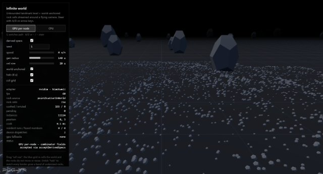
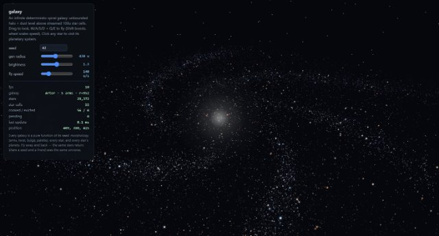
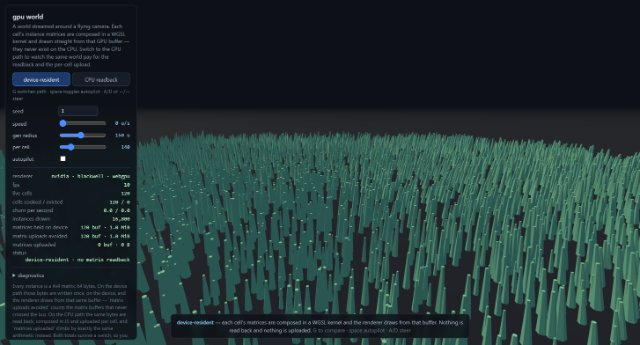

<!-- The wordmark ships white on transparent, which disappears against
     GitHub's light theme, so two colour variants are shipped and picked
     by prefers-color-scheme. The  is the light one because it is
     also the fallback wherever <picture> is not honoured. -->
<picture>
  <source media="(prefers-color-scheme: dark)" srcset="./docs/logo-dark.svg">
  
</picture>

**Build worlds out of rules instead of files.** You write the recipe —
scatter points over this ground, thin them out with noise, turn each
survivor a random amount, put a tree on every one — and pcg-ts runs it.
The recipe is a small graph of nodes; running it is called a *cook*. Feed
it the same seed and you get the same world back, byte for byte, on any
machine, forever.

pcg-ts is built for real-time use — cooking is budgeted and cancellable so
it can run inside a frame, and the field grammar compiles to WGSL to run
on a GPU device when one is there.


*Five nodes and a forest. `scatter-even` fills a square with evenly
spaced points, `mask-by-noise` deletes the ones that land in the quiet
parts of a noise field, `random-yaw` and `random-scale` vary whatever is
left, and `spawnInstances` puts a pine on each. Four of those five are
shipped [primitives](#the-primitive-library) — small graphs themselves,
dropped in as one node. The graph floats over the thing it just made;
the panel on the left drives it. That is the whole idea — everything
below is detail.
([Open it live.](https://c4rl05.github.io/pcg-ts/pages/editor/?graph=basics-compose-primitives))*

## Is this for me?

pcg-ts is a TypeScript library, not an application. It fits if you are
building:

- **A world with no edges** — terrain, a city, a galaxy — streamed in
  around a camera as it moves and generated on demand, instead of
  authored once and shipped as assets.
- **Content made of rules** — props placed by a density you paint with
  noise, a truss rig swept along a curve, a riverbank that follows its
  river — where the rules *are* the asset, and re-running them under a
  new seed is the point rather than an accident.
- **Something an agent drives.** Graphs are plain JSON, every node type
  carries machine-readable metadata, and an error names the node, pin, or
  param at fault. [For AI agents](#for-ai-agents) is the entry point.

It runs in the browser and in Node. three.js interop
(`pcg-ts/three`), WebGPU field evaluation (`pcg-ts/gpu`), off-thread
cooking (`pcg-ts/worker`) and the shipped primitive vocabulary
(`pcg-ts/primitives`) are each optional and each its own import — the
core never reaches for a renderer or a GPU on its own.

## Look before you install

All of this runs in a browser. Nothing to check out, nothing to build.

- **[One-page overview](https://c4rl05.github.io/pcg-ts/)** — what it is,
  the architecture and pipeline diagrams, and the roadmap.
- **[The gallery](https://c4rl05.github.io/pcg-ts/gallery.html)** — every
  graph in `graphs/` cooked, each frame backed by the node graph that made
  it and a click through to it live. The same index in prose, with what
  each file teaches, is [docs/graphs.md](./docs/graphs.md).
- **[The editor](https://c4rl05.github.io/pcg-ts/pages/editor/)** — open
  any of those graphs and edit it on the spot. Start with
  [the smallest one there is](https://c4rl05.github.io/pcg-ts/pages/editor/?graph=basics-scatter-in-bounds)
  (scatter points in a box), then
  [the suspended rig](https://c4rl05.github.io/pcg-ts/pages/editor/?graph=examples-rig)
  (83 nodes, swept curves, a knobs panel). More in
  [The editor](#the-editor).
- **[The user manual](https://c4rl05.github.io/pcg-ts/manual.html)** —
  this file's ground at book length, worked example by worked example,
  through the mental model, the JSON format, the field grammar, errors as
  an API, and a full agent loop.

And three demos, each one something a single graph cannot be on its own:

<table>
<tr>
<td width="33%"><a href="https://c4rl05.github.io/pcg-ts/pages/demos/infinite-world/"></a></td>
<td width="33%"><a href="https://c4rl05.github.io/pcg-ts/pages/demos/galaxy/"></a></td>
<td width="33%"><a href="https://c4rl05.github.io/pcg-ts/pages/demos/gpu-world/"></a></td>
</tr>
<tr>
<td><b><a href="https://c4rl05.github.io/pcg-ts/pages/demos/infinite-world/">infinite world</a></b><br>A world streamed around a flying camera, coarse to fine. Drag the cell size and watch the rocks not move.</td>
<td><b><a href="https://c4rl05.github.io/pcg-ts/pages/demos/galaxy/">galaxy</a></b><br>An unbounded spiral galaxy that is a pure function of its seed. Click a star to visit its planets.</td>
<td><b><a href="https://c4rl05.github.io/pcg-ts/pages/demos/gpu-world/">gpu world</a></b><br>The same streaming, with every instance matrix composed on the GPU and drawn without ever being read back.</td>
</tr>
</table>

## Install

```sh
npm install pcg-ts
# optional, only for the pcg-ts/three adapter:
npm install three
```

Requires Node 18+ (or any modern browser bundler). ESM only.

## Quickstart

Scatter points in a box, then displace them with a noise field:

```ts
import {
  Graph,
  cook,
  firstGeometry,
  pointScatterInBounds,
  jitterPoints,
  fbm,
  perlinNoise,
  remap,
} from "pcg-ts";

const graph = new Graph(42); // graph seed: all node seeds derive from it

const scatter = graph.add(pointScatterInBounds, {
  count: 500,
  boundsMin: [0, 0, 0],
  boundsMax: [50, 0, 50],
});

// `amount` is field-capable: a scalar noise field, evaluated per point,
// broadcasts to all three axes.
const jitter = graph.add(jitterPoints, {
  amount: remap(fbm(perlinNoise, { seed: 7, frequency: 0.05 }), -1, 1, 0, 1),
});

graph.connect(scatter, "out", jitter, "in");
graph.output(jitter, "out", "points");

const result = await cook(graph);
const geo = firstGeometry(result.outputs.points);
if (!geo) throw new Error("no geometry");

const P = geo.attrs.point.require("P"); // f32, 3 components per point
console.log(geo.pointCount, [...P.data.subarray(0, 3)]);
console.log(result.stats); // { cooked: 2, cached: 0, elapsedMs: ... }
```

Cook again and both nodes are served from cache; change a param
(`graph.setParam(scatter, "count", 1000)`) and only what depends on it
recooks. Same seed always reproduces the same bytes.

## Three foundations

Everything else in this file is built out of these three, so they are
worth the two minutes.

- **The data model.** Geometry is columns, not objects. Attributes live
  on domains (point / vertex / primitive / detail — [why exactly those
  four](./docs/design.md#why-four-domains)) as SoA typed-array columns,
  with promote and transfer between domains — transfer maps by nearest
  source point, by barycentric lookup in the source triangulation's UV
  space, or by raycast against the source mesh. The standard "point with
  attributes" is the point domain plus transform (`P`, `rot`, `scale`),
  `density`, bounds, `color`, and a per-point `seed`.
- **Fields.** A parameter can be a *recipe for a value* rather than a
  value. A field is a deferred function of evaluation context
  (`Field<T>`), resolved only when it lands on a domain — which is how
  one `amount: 3` becomes `amount: <this noise, sampled at each point>`
  without changing the node. Node params accept `T | Field<T>`;
  combinators and noise compose into expression trees; `capture` stores
  intermediate results as anonymous attributes.
- **The runtime.** Cooking is pull-based and remembers what it already
  did. A graph executor with content-keyed memoization, budgeted and
  cancellable cooking, and subgraph composition — plus a hierarchical
  `World` that streams grid cells around a viewpoint, coarse to fine,
  deterministically.

## For AI agents

The library is built to be driven by agents as well as by people: every
node type carries machine-readable metadata, graphs serialize to a stable
JSON format, and an error names the offending node, pin, or param and
states the valid alternatives or the fix. The entry points, all of which ship inside the npm package:

- [llms.txt](./llms.txt) — start here.
- [docs/nodes.md](./docs/nodes.md) — every node, its pins and its param
  schema (machine-readable: [docs/nodes.json](./docs/nodes.json)).
- [docs/primitives.md](./docs/primitives.md) — the shipped primitive
  vocabulary ([docs/primitives.json](./docs/primitives.json)).
- [docs/graphs.md](./docs/graphs.md) — the graph corpus, with what each
  file teaches ([docs/graphs.json](./docs/graphs.json)).
- [docs/authoring.md](./docs/authoring.md) — the JSON format spec and the
  field grammar.
- [docs/design.md](./docs/design.md) — why the library is shaped this way.
- [skills/](./skills) — three doctrine skills: `graph-authoring` (what to
  read first, primitive or nodes, the validate → cook → inspect loop),
  `determinism` (the seed chain, and how to verify reproducibility rather
  than assume it) and `performance-and-budgets` (what a cook costs, the
  two different budgets, and reading `pcg cook --stats`).

---

The rest of this file is the reference: each chapter is one subsystem,
with the code that exercises it. Read it in order or jump to what you
need.

## Fields

A `Field` is a deferred computation: it resolves to one column of values
when evaluated over a domain (`EvalContext` = geometry + domain + seed).
Inputs (`position()`, `attribute(name)`, `attributeIs(name, value)`,
`byAttribute(name, cases, default)`, `index()`, `fraction()`,
`nodeSeed()`, `randomField(key)`),
combinators (arithmetic, comparisons, trig from `sin` through `atan2`,
`exp`/`log`, `fract`/`mod`/`sign`, `clamp`/`lerp`/`remap`/`smoothstep`,
`select`, `ramp`, vector ops including `distance`), and noise
(`valueNoise`, `perlinNoise`, `simplexNoise`, `worleyNoise`, `fbm`) all
return fields, so expressions compose before any geometry exists:

```ts
import { createPointCloud, capture, attribute, clamp, add, mul, worleyNoise } from "pcg-ts";

// density = clamp(0.2 + worley * 0.9, 0, 1)
const density = clamp(add(0.2, mul(worleyNoise({ frequency: 0.15 }), 0.9)), 0, 1);

const geo = createPointCloud(1000);
// Evaluate over the point domain and store as a hidden anonymous
// attribute; read it back later with attribute(name).
const name = capture(geo, "point", density);
const col = attribute(name).evaluate({ geo, domain: "point", seed: 0 });
```

Raw numbers and tuples coerce to constants wherever a field is accepted
(scalars broadcast against tuples). Evaluated columns may alias live
attribute storage: treat them as read-only, and re-evaluate with a fresh
context after mutating the geometry.

A string attribute drives a field through `attributeIs(name, value)` — 1
where it matches, 0 elsewhere — and through nothing else. A fn returning
the string's table INDEX would look more general and be a determinism
bug: the table is insertion-ordered and rebuilt by clone, filter and
merge, so the same value sits at different indices in different cells of
a partitioned world. The predicate resolves the index against the
geometry in hand and never exposes it. The consequence to know: a
literal the geometry's table does not hold yields zeros rather than an
error, because a cell holding no pines legitimately has no `"pine"` — so
a misspelled literal reads as "nothing matches". A missing attribute
still throws, and so does a numeric one, naming `eq(attribute(name), n)`
as the thing you wanted.

`byAttribute(name, cases, default)` is the N-way form, for when the 2-way
one stops composing: sizing a part by its kind on three axes needs one
nested `lerp` per axis per kind, and the value an element takes when
every predicate reads 0 is written down nowhere. Its `default` is
required precisely because that unnamed fall-through is the defect. Be
clear about the limit, though — a case key is never validated against the
string table either, for the same reason, so a misspelled key is dead
code that quietly takes the default. What you gain is that the
fall-through is explicit and the case set is enumerable in one place.

Every noise field takes `normalized: true` for a uniform [0, 1] output
contract — an exact affine remap of the per-noise raw range, published
in `NOISE_RAW_RANGES` and queryable per field via `noiseOutputRange()`.
Worley additionally takes `exact: true` to widen its cell search until
provably correct (property-tested against brute force) when the fast
approximation's rare artifacts matter.

## The graph runtime

`Graph` is code-first: `add` node instances, `connect` typed pins
(geometry / value / instances / any; `multi` inputs concatenate),
declare terminal `output`s, then `cook`. Validation is eager — bad pin
names, kind mismatches, and cycles throw at `connect` time with the node
and pin named.

- **Caching.** Each node memoizes on (type, param hash, node seed, input
  item revisions). Data items carry monotonically assigned `rev` ids, so
  caching never deep-hashes geometry; unchanged outputs keep their revs
  and cleanliness propagates downstream. `CookResult.stats` reports
  cooked vs cached counts.
- **Budgeted cooking.** `cook(graph, { budgetMs })` yields to the event
  loop between nodes once the budget elapses — cooking always completes,
  it just shares the thread.
- **Cancellation.** `cook(graph, { signal })` rejects with
  `CookCancelledError`; completed nodes keep their caches, so the next
  cook resumes where the cancelled one left off.
- **Per-output cooking.** `cook(graph, { outputs: ["a"] })` cooks only
  the named outputs' upstream subgraph; everything else is untouched and
  keeps its caches. Staged pipelines fit in one graph — cook the early
  output, bind data derived from it, then cook the rest.
- **Subgraphs.** `subgraphNode(inner, exposedInputs, exposedOutputs,
  exposedParams)` wraps a whole graph as one node with its own persistent
  inner caches. Exposed params give the wrapper its own knobs, each bound
  to one or more inner params, with schemas derived from those params
  rather than hand-written. `registerSubgraph(name, recipe)` publishes one
  under a name, so a serialized graph can reference it instead of
  embedding a copy — and cook byte-identically either way.
- **Live editing.** `removeNode` cascades: every connection touching the
  node and every output declared on it go with it, in a single version
  bump — downstream nodes recook on the next cook, untouched branches
  keep their caches. `disconnect` and `removeOutput` follow the same
  cache contract; unknown nodes, pins, or output names throw actionably,
  while disconnecting a connection that simply isn't there returns
  `false`.
- **Introspection.** For tooling, `describe()` returns a frozen
  structural snapshot of the live graph (nodes with their derived seeds,
  connections, declared outputs — insertion order) and `getParams` a
  frozen snapshot of a node's current params: reads that cannot mutate
  the graph behind the version counter.

## JSON authoring (for agents, editors, tools)

Everything needed to author a graph without reading source is available
at runtime. `listNodeTypes()` returns every registered node type with its
pins, its per-param schemas (type, default, range, enum values, field
capability, description) and a grouping `category`, so palettes and
generated docs group without heuristics. Field capability is declared per
*param* and never per type — a sibling param of the same type may well
refuse an expression — so the schema is the only authority worth reading.

Graphs round-trip through a stable, versioned JSON format, and
field-valued params are declarative JSON specs:

```ts
import { deserializeGraph, serializeGraph, fieldFromJson, cook } from "pcg-ts";

const graph = deserializeGraph({
  formatVersion: 1,
  seed: 42,
  nodes: [
    { id: "scatter", type: "pointScatterInBounds",
      params: { count: 500, boundsMin: [0, 0, 0], boundsMax: [50, 0, 50] } },
    { id: "jitter", type: "jitterPoints",
      params: { amount: { fn: "fbm", base: "perlinNoise", opts: { frequency: 0.05 } } } },
  ],
  connections: [{ from: ["scatter", "out"], to: ["jitter", "in"] }],
  outputs: [{ id: "jitter", pin: "out", name: "points" }],
});

const roundTrip = serializeGraph(graph); // structurally equal JSON back
const result = await cook(graph);
```

Three things about the format are worth knowing up front; the rest is
[docs/authoring.md](./docs/authoring.md).

**One value, many nodes.** A top-level `params` array holds authored
quantities — a cable radius, a truss half-width — that any node's field
expression reads by name with `{ "fn": "param", "name": "tubeRadius" }`.
Binding happens at deserialize by substitution, so a declared value cooks
byte-identically to the same number written out in every slot, and
`setGraphParam` re-keys exactly the nodes that read it. Adding `targets`
reaches params an expression cannot — an `i32` count, a `bool`, an
`enum` — by writing the value into those slots outright. Either way it
holds a literal, never an expression: a value that can compute is a node.

**A saved noise can be deaf to the seed box.** A serialized field
expression bakes its numbers, so a noise carrying a literal `opts.seed`
does not move when the graph seed does. Besides an integer, `opts.seed`
takes `{ "from": "node", "variant": 5 }`, which derives the seed from the
cooking node's own seed — so the seed box moves the surface and not
merely the points on it. `graphs/basics-reseed-a-noise.json` is the
worked case.

**Field params serialize whichever way you authored them.** A field built
from the combinator API — `mul(position(), 0.1)` — derives its spec from
its arguments and round-trips exactly as a `fieldFromJson` spec does.
Only fields the grammar genuinely cannot describe refuse, chiefly
`makeField` closures and anything composed over one, and the error names
the offending node, param and leaf rather than a list to choose from.

Serialization is complete: subgraph nodes carry their inner graph as a
nested payload or as a hash-pinned reference to a registered one, and
deserialization validates node types, param schemas, bounds, enum
membership, pins, connections and the key sets themselves at every object
position — every error naming what is at fault and what would be valid.
See [llms.txt](./llms.txt) for the compact agent guide,
[docs/authoring.md](./docs/authoring.md) for the format spec and field
grammar, and [docs/nodes.md](./docs/nodes.md) for the full node reference
(generated from the registry). [The editor](#the-editor) is this section
as an app, and it runs in the browser:
<https://c4rl05.github.io/pcg-ts/pages/editor/>.

### The primitive library

The library ships a catalog of named subgraphs — the vocabulary a graph
is written IN, rather than assembled from nodes every time. They register
on import of their own subpath, so `import "pcg-ts"` keeps costing
nothing:

```ts
import "pcg-ts/primitives";
```

Names are `<family>/<kebab-case>` over seven families — `shape` `fill`
`transform` `compose` `filter` `place` `write` — and the family is a
promise about the pin shape, so they chain without reading inner graphs.
A graph references one by name:

```json
{ "id": "trees", "type": "subgraph",
  "params": { "count": 4000, "minDistance": 3 },
  "ref": { "name": "fill/scatter-even" } }
```

Each carries its own agent-facing description, the exposed params with
derived schemas, and — where it matters — a statement of whether two
instances of it differ by default, which is the counter-intuitive part:
scattering varies per instance automatically, noise does not, and a seed
cannot make it. A noise seed is fixed when the field is BUILT — it takes
an integer or the tagged `{ "from": "node", "variant": N }` form and
nothing else, so it picks a whole draw and can never vary per element —
which is why noise-driven primitives expose a `variant` that walks the
sample position to an unrelated part of the same infinite field instead.
The generated reference is
[docs/primitives.md](./docs/primitives.md) (machine-readable:
[docs/primitives.json](./docs/primitives.json)), and `pcg run
fill/scatter-even --param minDistance=3` cooks one from the command line
with no graph file at all.

### Paths and networks


*[`graphs/examples-rig.json`](https://c4rl05.github.io/pcg-ts/pages/editor/?graph=examples-rig),
shaded by normals. Every tube, strut, cable and swag here is a path: one
spine curve, resampled and swept, with the rest built by walking it.*


A path is topology, not a point type and not an attribute: `polyline`
primitives whose vertices reference point indices, sitting beside the
point domain rather than replacing it. The points keep everything they
were carrying; the path adds the statement that they are visited in an
order. `pointsToPath` lays that topology over points a graph already
made — the only way to start a path from serialized JSON — and the shipped
`shape/path-*` primitives are the ready-made sources built on it. From
there, `pathResample` respaces one, `writeTangents` gives its own points
a direction, and `splineSample` walks it by arc length.

The same representation, allowed to branch, is a **network**.
`connectPoints` joins a cloud into one 2-vertex polyline per edge over
the *same* points — every pair within a `radius`, or the sparser
`relativeNeighborhood` lune test that keeps a road-shaped net which still
contains a minimum spanning tree — so a crossroads where three roads meet
is genuinely one point of degree 3, carrying everything it carried
before. There is **no edge domain and none is needed**: an edge is a
`primitive`, so a per-edge value is `promoteAttribute` point→primitive,
a `setAttribute` on `domain: "primitive"`, and `promoteAttribute`
primitive→point for the return trip to the junction. Nor does the value
stop at the edge: every sampler that reads a polyline carries the source
primitive's attributes onto the points it emits, so a lamp placed along a
road arrives already knowing that road's width — a sample inherits the
primitive it was taken from, with no param to enable it. Stage 5 of the
shipped example pipeline is exactly that, end to end.

Two contracts are worth knowing before the first path graph. **Closure
is structural** — a closed path is one whose last vertex references its
first point, and there is no `closed` attribute to write or read, so
nothing can disagree with the geometry. And **a path that passes through
a filter stops being a path** — as does a network: every filter that can
remove a point rebuilds the point domain from the survivors and drops
topology with it, as do `mergePoints` and `partitionByAttribute`. Three
filters are exempt — `projectToPlane`, which removes nothing, and the two
primitive filters, `filterPrimitivesByBounds` and
`filterPrimitivesByAttribute`, which remove whole primitives rather than
points and so trim a network instead of demolishing it. Combining two
geometries has its own exemption: `mergePrimitives` concatenates points,
vertices *and* primitives and renumbers each input's references, so an
authored path joined to a generated network stays one network, where
`mergePoints` would hand back both as loose points. Nothing warns
where the loss happens, so build the path or the network after the last
filter. The full contract is in docs/authoring.md —
[Paths](./docs/authoring.md#paths) for closure and ordering,
[Networks](./docs/authoring.md#networks-the-primitive-domain-is-the-edge-domain)
for per-edge values and for how a partitioned cook owns an edge instead of
filtering one.

## The editor


*The editor with everything turned on, on the same rig graph: the node
graph as a full-bleed overlay over its own cook, a per-graph knobs panel
down the left, and the inspector on the right showing a field expression
as TEXT — the same tree the JSON holds, printed.*


`editor/` is a tool, not a demo: it opens any graph in `graphs/` and
edits it live. It is hosted, so there is nothing to install —
<https://c4rl05.github.io/pcg-ts/pages/editor/> — and `?graph=<name>`
opens one of the corpus graphs directly:
[`examples-rig`](https://c4rl05.github.io/pcg-ts/pages/editor/?graph=examples-rig)
(the screenshot above),
[`examples-gpu-fields`](https://c4rl05.github.io/pcg-ts/pages/editor/?graph=examples-gpu-fields)
(the fusable chain [GPU cooking](#gpu-cooking-webgpu) measures), or
[`basics-scatter-in-bounds`](https://c4rl05.github.io/pcg-ts/pages/editor/?graph=basics-scatter-in-bounds)
(the smallest one there is — scatter points in a box).

Nothing in it is hand-maintained, which is what makes it the JSON
authoring chapter as an app: the palette groups by `listNodeTypes()`'
categories and is summoned at the pointer with **Tab**, the inspector
renders every param from its schema — including whether that param
accepts a field — and the prose beside a node comes from the registry,
so a node added to the library shows up in the editor with no editor
change. Graphs load
and save through `deserializeGraph`/`serializeGraph`, but editing goes
through the graph's own mutation API rather than a rebuild from JSON, so
deleting or rewiring one branch leaves every untouched branch's caches
warm.

The graph is a full-bleed overlay over its own cooked render. **Space**
cycles the three views — scene, scene + graph, graph only — and
shift-space walks back; **F** re-frames the scene, **Ctrl/Cmd+0** puts
the graph canvas back to 100%, and **Delete** removes the selected node.
The toolbar carries the graph picker, the seed box, export and import,
a `shade` selector (lit / normals, a redraw rather than a recook), fit /
100% / a deterministic auto-layout, and a `cook` selector switching
**cpu**, **gpu · per-node** and **gpu · fused** under an unchanged
graph. The status line reports fps, cook ms, cooked/cached, outputs,
points, instances, what was drawn and an output hash — plus the
`CookStats.gpu` counters on the device paths, which is what makes the
GPU chapter's claims checkable rather than quotable. A graph with a
`graphs/panels/<name>.json` file also gets a curated knobs panel down
the left, whose `copy link` produces a shareable
`?graph=<name>&p=<patch>` URL.

A field-capable param carries a constant/field toggle, and in field mode
the expression is TEXT — printed by `printFieldSpec`, read back by
`parseFieldText`, both public — or, on demand, a read-only
boxes-and-wires diagram of the same tree. No JSON is shown: the spec
tree is still the format, it is simply not the notation a human edits.

## Hierarchical streaming

A `World` streams cells of grid levels (coarse to fine, one graph per
level) around a moving viewpoint, with budgeted cooking, hysteresis,
LRU eviction, and invalidation:

```ts
import { Graph, World, pointScatterInBounds, spawnInstances } from "pcg-ts";

const level = new Graph();
const scatter = level.add(pointScatterInBounds, { count: 200 });
const spawn = level.add(spawnInstances, { assetId: "tree" });
level.connect(scatter, "out", spawn, "in");
level.output(spawn, "instances", "instances");

const world = new World({
  seed: 1234,
  levels: [
    {
      name: "props",
      cellSize: 32,          // world units per cell (XZ plane)
      generationRadius: 96,  // cells cook when their center enters this radius
      graph: level,
      bind(graph, ctx) {
        // The only channel through which cell data enters the graph.
        // Determinism contract: derive params only from ctx, and wire
        // ctx.seed into every stochastic node.
        graph.setParam(scatter, "boundsMin", [ctx.min[0], 0, ctx.min[1]]);
        graph.setParam(scatter, "boundsMax", [ctx.max[0], 0, ctx.max[1]]);
        graph.setParam(scatter, "seed", ctx.seed);
      },
    },
  ],
  onCellReady: (level, coord, outputs) => {/* hand outputs to the renderer */},
  onCellEvicted: (level, coord) => {/* tear down renderer state */},
});

// Per frame (or on movement); overlapping calls are serialized.
await world.update([camera.x, camera.y, camera.z], { budgetMs: 8 });
```

Each cell's seed hashes the world seed, the level index, and every cell
coordinate (`hashCombine(worldSeed, levelIndex, cx, cz)` above), so cell
content is a pure function of (world seed, level, coordinate, graph,
parent cell content) — never of cook order, viewpoint path, or eviction
history. Wire `ctx.seed` into each stochastic node, or reseed the whole
graph with `graph.setSeed(...)` inside `bind` — both are sanctioned
(`setAttribute` also takes an optional `seed` param that folds a
per-cell value into its field evaluation). Lower levels see their parent
cell's outputs via `ctx.parent` (typically injected through a
`dataInput` node), and a parent recook automatically marks its children
stale.

### Content that crosses a cell boundary

`ctx.seed` is per-cell by construction, so it is exactly wrong for
anything that has to look the same from either side of a boundary. `ctx`
also carries two cell-**invariant** seeds for that case: `ctx.worldSeed`
(the `World`'s own seed, identical everywhere) and `ctx.levelSeed`
(`hashCombine(worldSeed, levelIndex)`, identical within a level, so two
levels running the same graph get unrelated worlds rather than the same
one).

The source that uses them is `pointScatterInWorld`. It scatters over an
infinite lattice anchored to world coordinates: a point's position and
per-point seed come from its own lattice cell and index, and the query
box only chooses which cells to visit and clips the result half-open. So
**a halo is just a wider query** — nothing is fetched from a sibling
cell, which need never have cooked — and a region cooked whole is
byte-identical to the same region cooked in pieces.
`pointScatterInBounds` computes positions *from* its bounds, so widening
it moves every point and reproduces nothing.

```ts
bind(graph, ctx) {
  const halo = 6; // >= the radius of the widest measurement below
  graph.setParam(rocks, "boundsMin", [ctx.min[0] - halo, 0, ctx.min[1] - halo]);
  graph.setParam(rocks, "boundsMax", [ctx.max[0] + halo, 0, ctx.max[1] + halo]);
  graph.setParam(rocks, "seed", hashCombine(ctx.worldSeed, 1)); // not ctx.seed
  // ... pointNeighborhood runs over the WIDE cloud (exact when halo >= radius) ...
  graph.setParam(clip, "boundsMin", [ctx.min[0], -Infinity, ctx.min[1]]);
  graph.setParam(clip, "boundsMax", [ctx.max[0], Infinity, ctx.max[1]]);
}
```

That last node is `filterByBounds` at its default `halfOpen` boundary
(`min <= p < max`), which is the ownership rule of a partitioned cook:
two abutting cells claim a point on their shared face exactly once
between them. Downstream ops stay anchored on their own —
`filterByDensity`, `jitterPoints`, `randomField` and the tiebreaks in
`selfPrune` and `pointNeighborhood` key their randomness on each point's
*identity* (its position bits plus its `seed` attribute) rather than on
an array index, so an upstream filter that renumbers everything cannot
move a survivor's draw. The seeded ones still need a cell-invariant seed;
[docs/authoring.md](./docs/authoring.md) ("Content that must NOT vary per
cell") has the full table, and `demos/infinite-world` reproduces
each failure live with a toggle.

Levels use square XZ-plane cells by default; `cellMode: "xyz"` switches
a level to cube cells addressed `[cx, cy, cz]`, with radii measured in
full XYZ distance and all three coordinates hashed into the cell seed
(`ctx` is a discriminated union on `cellMode`, so `bind` can narrow it).
An optional leading `cellSize: "unbounded"` level covers the world with
one global cell and needs no `generationRadius`. `cookOutputs: [...]` on
a level cooks only those declared outputs per cell — a terminal branch
another consumer uses costs the level nothing.

## three.js interop

`pcg-ts/three` is the only module that imports `three` (an optional
peer dependency); the core is renderer-agnostic.

```ts
import { BoxGeometry, MeshStandardMaterial, SphereGeometry } from "three";
import { fromBufferGeometry, toInstancedMeshes } from "pcg-ts/three";
import { Graph, cook, dataInput, makeGeometryItem, surfaceSample, spawnInstances } from "pcg-ts";

// three -> pcg: a triangle mesh becomes sampleable geometry.
const surface = fromBufferGeometry(new BoxGeometry(10, 1, 10));

const graph = new Graph(7);
const input = graph.add(dataInput, { items: [makeGeometryItem(surface)] });
const sample = graph.add(surfaceSample, { count: 2000 });
const spawn = graph.add(spawnInstances, { assetId: "rock" });
graph.connect(input, "out", sample, "in");
graph.connect(sample, "out", spawn, "in");
graph.output(spawn, "instances", "instances");

// pcg -> three: instance batches become InstancedMesh objects.
const { outputs } = await cook(graph);
for (const item of outputs.instances) {
  if (item.kind !== "instances") continue;
  const meshes = toInstancedMeshes(item.batches, {
    rock: { geometry: new SphereGeometry(0.1), material: new MeshStandardMaterial() },
  });
  // meshes[i] is a THREE.InstancedMesh; add to your scene.
}
```

Multi-asset spawns stay declarative: write a per-point string attribute
with `setAttribute` (`type: "string"`, a `values` list, and a
field-capable selector that picks per point) and name it in
`spawnInstances`' `assetAttr` — batches then split by asset id (in
ascending first-occurrence point order), and `orientAlongVector` turns
a direction attribute (a surface normal, a spline tangent) into the
standard `rot` quaternion without leaving the graph. Since v0.8.0 such
a spawn can be device-resident too — composed on the GPU and handed to
the renderer without a CPU round trip — not just a CPU one. See
`graphs/examples-forest.json` and
`graphs/basics-props-along-a-path.json`.

Which asset ids a graph will ask for is answerable before it cooks:
`pcg assets <graph.json>` reads every `spawnInstances` node's params
and the authored string tables that feed them, and reports the spawner
count and the distinct ids across every branch rather than the one a
seed happened to reach. A set that depends on values the walk cannot see
is reported OPEN rather than guessed, which is the signal that the list
is a lower bound. It is what an author checks a host's asset map
against, and it costs no cook.

**Per-instance colour, and why you have to ask for it.** Splitting into
more asset ids is not the only variation channel. Point `spawnInstances`'
`colorAttr` at an f32 point attribute with `tupleSize >= 3` and
components 0/1/2 ride along as each instance's RGB — reaching
`InstancedMesh.instanceColor` on the CPU path and an instance-colour
storage buffer on the WebGPU one — so age, health, season or a hue drift
vary *within* one asset. Alpha is dropped: both adapters take RGB.

It is opt-in because every point cloud in this library already carries
`color` at `[1,1,1,1]`, so its presence says nothing about intent, and
enabling it for zero pixels changed would force a three shader recompile.
Naming the attribute is what states the intent — `color`, or a
`tint`/`speciesColor` you wrote yourself. The accepted cost: write
`setAttribute("color", ...)` upstream, never name it here, and you get
silence rather than a warning.
**A spawn is budgeted.** One cook may spawn at most 1 048 576 instances
(one per input point — 64 MiB of matrices), checked before anything is
allocated, so a density typo is a diagnostic naming the count and the
fix instead of an allocation failure. The ceiling is per **cook**, never
per world: a global "instances alive" limit would depend on which cells
happened to be resident, which is order-dependent and so a determinism
violation. A streamed `World` may legitimately hold many times the
budget across its live cells.

Also available: `fromCurve` (a `THREE.Curve` becomes a polyline for
`splineSample`), `toPointsObject` (debug point rendering), and
`WorldThreeBinding`, which manages one scene-graph group per live
`World` cell — pass its `cellReady`/`cellEvicted` methods into the
`World`'s `onCellReady`/`onCellEvicted` callbacks.

With a `THREE.WebGPURenderer`, `createWebGpuInstanceAdapter` lets the
same binding draw instance matrices straight out of the GPU buffer the
cook composed them in, skipping the `Float32Array` entirely — see
[Device-resident instancing](#device-resident-instancing) below.
`three/webgpu` is imported lazily by that factory, so a WebGL app pays
nothing for its existence.

## GPU cooking (WebGPU)


*The `cook` selector switched to **gpu · fused** under an unchanged
graph. `1 / 2 run / fused`, `1 readbacks saved` and `suffix-fused` in the
status line are `CookStats.gpu` — which is what makes this chapter's
claims checkable rather than quotable. ([Open it
live.](https://c4rl05.github.io/pcg-ts/pages/editor/?graph=examples-gpu-fields))*

`pcg-ts/gpu` compiles the serializable field-expression grammar to WGSL
compute kernels, runs them on a WebGPU device, and fuses chains of
field-driven nodes into single device-resident runs. The core never
imports it (guard-tested, like `pcg-ts/three`); the graph layer sees only
a structural resolver interface, injected per cook:

```ts
import { cook } from "pcg-ts";
import { GpuFieldEvaluator } from "pcg-ts/gpu";

const adapter = await navigator.gpu.requestAdapter();
if (!adapter) throw new Error("no WebGPU adapter");
const device = await adapter.requestDevice();
const gpu = new GpuFieldEvaluator(device, { adapterInfo: adapter.info });

const result = await cook(graph, { gpu });
console.log(result.stats.gpu);
// { dispatches, pipelinesCompiled, pipelineCacheHits,
//   residentRuns, fusedNodes, readbacksSaved, fallbacks: {...} }
```

In Node, `npm i -D webgpu` supplies Dawn bindings; the library itself
depends on nothing.

**The whole grammar compiles** — arithmetic, trig,
`clamp`/`lerp`/`remap`/`select`/`ramp`, vector ops, and all noise
including `fbm` and exact worley. Ten nodes resolve their field params on
the device, subgraphs forward the resolver inward, and
`WorldOptions.gpu` threads one into every cell cook. Element count is
never a limit: kernels past the 4.19M-element dispatch ceiling chunk
with byte-identical output.

**Nothing fails silently.** An ineligible field falls back to the CPU and
is *counted*, with a machine-readable reason — `no-spec`,
`derived-spec`, `compile-error`, `too-many-buffers` per field, and
`run-plan-failed`, `run-too-large` per fused run. That is the complete
vocabulary.

**Fusion.** When the resolver implements the optional
`planRun`/`executeRun` pair, the executor finds maximal linear chains of
count-preserving field-driven nodes and cooks each as one device round
trip — columns stay in storage buffers across member kernels and only the
run's terminal reads back. Runs end at a non-fusable node, at a declared
graph output, and at any fan-out, so fusion never changes which bytes the
rest of the graph observes.

**Authored vs derived specs.** A field built by `fieldFromJson` is
*authored* and device-eligible; one built from the combinator API is
*derived* and eligible only under `acceptDerivedSpecs: true`. It is
opt-in because accepting derived specs would move output bytes for every
graph that already passes a resolver and never asked.

**Parity, in one paragraph.** The CPU is the bit-exact reference; the GPU
is a documented approximation of it. Hash and random streams are
bit-exact, as are `index`, integer reads and pure hash+compare+select
trees. Float arithmetic matches within measured per-op-family budgets
(add/sub/mul bit-exact, div/lerp/dot ≤ 1, sin/cos ≤ 12, noise ≤ 6–24, in
range-ULP units on one adapter). Per-instance colour is bit-exact for a
structural reason — it is a gather, not arithmetic. On a single device,
results are run-to-run **byte-identical**; that promise is about the same
path re-run, not about CPU and GPU agreeing to the last bit.

**The full reference** — fusion eligibility rules and the run cache
contract, every stats counter and how to read a benchmark,
`maxResidentBytes` and the buffer pool, cache-salt provenance, the
measured parity table with its raw and range-ULP columns, and the
out-of-domain behaviour — is in docs/authoring.md:
[eligibility](./docs/authoring.md#eligibility--what-runs-on-the-gpu),
[fusion](./docs/authoring.md#device-resident-runs-fusion),
[cache provenance](./docs/authoring.md#cache-provenance) and
[the determinism contract](./docs/authoring.md#determinism-contract-and-measured-budgets).

See it live: [the editor](#the-editor)'s `cook` selector switches between
CPU, GPU per-node and one fused device-resident run under a graph that
does not change. Open it on
[`examples-gpu-fields`](https://c4rl05.github.io/pcg-ts/pages/editor/?graph=examples-gpu-fields)
([source](./graphs/examples-gpu-fields.json)) and watch two numbers: the
time moves, and the output hash holds across the two device paths but not
across the CPU.

## Device-resident instancing

A fused run normally ends by reading its result back to the CPU. With a
WebGPU renderer on the other side there is no reason to: the instance
matrices already live in the memory of the same GPU device the renderer
draws from. Opt in with `deviceInstances: true` and a `spawnInstances`
terminal composes every 4×4 on the GPU and hands back **buffer handles**
instead of `Float32Array`s — no readback, no CPU compose loop, no
`instanceMatrix` upload on the way back out.

```ts
import { World } from "pcg-ts";
import { GpuFieldEvaluator } from "pcg-ts/gpu";
import { WorldThreeBinding, createWebGpuInstanceAdapter } from "pcg-ts/three";
import { WebGPURenderer } from "three/webgpu";

// ONE device, two consumers. This is the whole feature.
const gpuAdapter = await navigator.gpu.requestAdapter();
if (!gpuAdapter) throw new Error("no WebGPU adapter");
const device = await gpuAdapter.requestDevice();

const renderer = new WebGPURenderer({ device });
await renderer.init();                       // must be initialized first

const gpu = new GpuFieldEvaluator(device, {
  adapterInfo: gpuAdapter.info,
  deviceInstances: true,                     // advertises spawnInstances
});
const adapter = await createWebGpuInstanceAdapter({ renderer, assets });

const binding = new WorldThreeBinding({
  group, assets,
  deviceInstances: { adapter, bounds: (level, coord) => cellSphere(level, coord) },
});
const world = new World({
  ..., gpu,
  onCellReady: (l, c, outputs) => binding.cellReady(l, c, outputs),
  onCellEvicted: (l, c) => binding.cellEvicted(l, c),
});
```

**The same `GPUDevice` must back both halves** — a hard requirement of
the platform, not a convenience. A `GPUBuffer` belongs to the device that
created it, and a WebGL context cannot read a WebGPU buffer at all. A
batch arriving from anywhere else is refused by name rather than drawing
nothing.

**What comes back.** The `instances` item carries `deviceBatches`, not
`batches` — one entry per asset, each `{ residency: "device", assetId,
count, transforms, colors? }`, where `transforms` is an opaque
`DeviceTransformsHandle`, never a typed array. Reading `batches` on such
an item throws on purpose, naming both ways out. Multi-asset
(`assetAttr`) spawns are resident too, and their batch order is part of
the contract: ascending first-occurrence point index.

**Who frees what.** The graph delivers handles but never owns them —
a terminal that produced device batches writes a *volatile* cache entry,
so every cook yields a fresh handle. `WorldThreeBinding` is the owner of
last resort, reference-counting by identity and disposing at the last
release. Leaks are visible rather than silent: `evaluator.poolStats` and
`binding.deviceHandleCount` report the same population from both sides,
and over a sustained fly-through both must reach a steady state.

**The CPU stays the reference.** The compose kernel works in f32
throughout where `composeTRS` keeps an f64 interior, so device matrices
are a documented tolerance class rather than a bit-exact port — these
bytes drive a renderer, not a seed chain. The translation column is
byte-identical always, basis deviation stays ≤ 1e-6 absolute, and colour
is bit-exact because it is a gather. Nothing the compose kernel produces
re-enters the graph: a spawner writes no attribute, so the handle goes to
the renderer and never into a seed, an index, or a subsequent cook. If
you need matrices matching the CPU bit for bit, leave `deviceInstances`
off.

**This leans on three's renderer internals, and says so loudly.** three
publishes no supported way to render from a `GPUBuffer` you already own.
The peer range is pinned to `three@^0.185.1` and `checkAdoptionSeam` runs
at construction, so a moved internal fails at startup rather than drawing
wrong matrices at frame time.

The full reference — the spawner terminal's kernel, the complete
multi-asset ordering rules, buffer lifetime across all four disposal
paths, reading `deviceHandleBytes` as a leak meter, and the adoption-seam
error in full — is in
[docs/authoring.md](./docs/authoring.md#device-resident-instancing-drawing-without-a-readback).

See it live: [`demos/gpu-world`](./demos/gpu-world) streams a `World`
whose cells render from matrices that never touch the CPU, showing the
binding's live handle count and the pool's detached-buffer accounting
side by side. For the multi-asset shape,
[`graphs/examples-forest.json`](./graphs/examples-forest.json) spawns
with `assetAttr: "species"` and toggles between the two paths.

## Determinism guarantees

What the library promises:

- **Same seed → identical output.** All randomness flows from seeds via
  PCG32 and murmur-style hash combining (`hashCombine`), never
  `Math.random`. Same graph + same seed produce byte-identical results
  across runs and platforms.
- **On the CPU.** Every promise in this chapter is about the CPU path,
  which is the reference. Cooking on the GPU device is bit-exact for
  elementwise arithmetic and a documented approximation for the noise
  interiors, which round in f32 — see the per-family tolerance table
  above. That is the one place "identical" means "within a published
  budget" rather than "the same bytes", and it is why the CPU stays the
  reference rather than the fallback.
- **Order and path independence.** Per-point randomness is hashed from
  (seed, index, axis), per-cell seeds from (world seed, level, coords).
  Cook order, streaming order, cancellation, eviction, and recooks never
  change the bytes produced.
- **Window independence, where it is promised.** The nodes that have to
  survive being asked twice at two sizes key on point *identity* — the
  stored position bits plus the point's `seed` attribute — instead of on
  an array index: `filterByDensity` (probabilistic), `jitterPoints`,
  `randomField` on the point domain, and the tiebreaks in `selfPrune` and
  `pointNeighborhood`. Paired with a world-anchored source, that is what
  makes a halo reproduce a neighbour exactly. A PRIMITIVE has an
  identity too — the order-independent fold of its own points'
  identities — so `randomField` there survives a reordered network and
  gives an edge and its reverse the same draw. (Vertex and detail keep
  the index: detail is one element, and a vertex is a point *and* a
  place within a primitive, which is a different question nothing has
  asked yet. `surfaceSample` keys on index too, because it manufactures
  its own candidates.)
- **One deliberate exception to the seed chain.** `pointScatterInWorld`
  derives its lattice from its own `seed` param alone — the graph seed
  never reaches it — so a `graph.setSeed` inside a level's `bind`, a CLI
  `--seed` override or a node rename cannot silently de-anchor a world.
  The trade is that two such nodes with identical params scatter
  identical points; give each layer its own seed value.
- **Introspectable execution.** Cook stats, cache hit/miss counts, and
  per-node progress callbacks expose what actually ran.

What the caller must respect (the mutation contracts):

- **Cook results are immutable.** `CookResult` collections (and the
  geometry inside) alias live cache internals; mutating them corrupts
  the cache undetectably. Use `cloneGeometry` first. Node authors have
  the same duty: `execute` must treat inputs as immutable and derive all
  randomness from its `seed` argument.
- **Bound arrays are frozen.** Arrays bound into params (e.g. a
  `dataInput` node's `items`) are captured by reference; mutate them in
  place and stored cell outputs change with no staleness signal. Bind a
  fresh array instead.
- **Columns are transient.** An evaluated field `Column` may alias
  attribute storage and is valid only until the geometry is mutated or
  resized; re-evaluate with a fresh `EvalContext` after mutating.
- **Don't edit a graph mid-cook.** Edits while a cook or `World.update`
  is in flight are detected and heal on the next pass, but that pass may
  return a torn mix of old and new state.

## Examples

`demos/` holds the three vite pages [pictured at the
top](#look-before-you-install), each one something a serialized graph
cannot be on its own: an infinite streaming world
([live](https://c4rl05.github.io/pcg-ts/pages/demos/infinite-world/)), an
infinite deterministic spiral galaxy with click-to-visit star systems
([live](https://c4rl05.github.io/pcg-ts/pages/demos/galaxy/)), and a
streamed world drawing from device-resident instance transforms
([live](https://c4rl05.github.io/pcg-ts/pages/demos/gpu-world/)).
[`editor/`](#the-editor) beside them is a tool rather than a demo, and
has its own chapter above.

A recipe that is only one cook of one graph is not a demo here; it is
one of the 67 files in `graphs/`, cooked by `pcg cook`, rendered by
`npm run preview`, editable in the editor, and pictured in [the
gallery](https://c4rl05.github.io/pcg-ts/gallery.html). All of it runs
locally from one vite server:

```sh
npm run examples
```

## Development

```sh
npm test          # vitest: unit + integration + determinism suites
npm run build     # tsup: dist/ with every subpath export package.json names
npm run check     # tsc --noEmit, then svelte-check over the browser pages
npm run examples  # vite dev server for editor/, demos/ and graphs/
npm run docs      # regenerate docs/{nodes,primitives,graphs}.{md,json}
                  # and the site pages from the registry; CI fails if stale
```

## License

MIT
